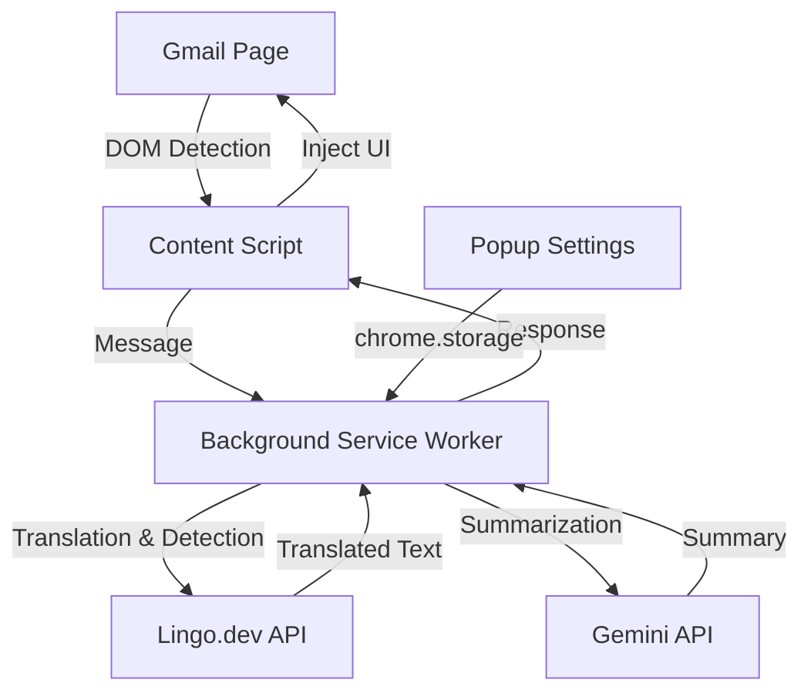

# 🌐 Lingo-Mail

**Multilingual Email Translator for Gmail** — A Chrome extension that auto-translates incoming emails, translates replies, summarizes emails with AI, and reads them aloud.


---

## ✨ Features

| Feature | Description |
|---|---|
| 🌐 **Auto-Translate Emails** | Automatically detects and translates incoming emails to your preferred language |
| 🔄 **Toggle View** | Switch between original and translated text with one click |
| ✍️ **Reply Translation** | Translate your replies into any supported language before sending |
| 📄 **PDF Translation** | Extract and translate text from PDF email attachments |
| ✨ **AI Summarization** | Get concise 2–3 bullet point summaries of emails using Gemini AI |
| 🔊 **Read Aloud** | Listen to translated emails using text-to-speech |
| 🌙 **Dark Mode** | Fully supports Gmail's dark theme |
| 🌍 **35+ Languages** | English, Spanish, French, German, Hindi, Tamil, Arabic, Chinese, Japanese, Korean, and many more |

---

## 🏗️ Architecture



### Component Breakdown

| Component | File | Role |
|---|---|---|
| **Service Worker** | `background.js` | Routes messages, calls Lingo.dev & Gemini APIs |
| **Content Script** | `content.js` | Gmail DOM observer, UI injection, user interactions |
| **Content Styles** | `content.css` | Translated blocks, buttons, modals, dark mode |
| **Settings Popup** | `popup.html/css/js` | API key management, language selection, preferences |
| **PDF Library** | `lib/pdf.min.js` | PDF text extraction via pdf.js |
| **Manifest** | `manifest.json` | Chrome MV3 extension configuration |

---

## 📁 Project Structure

```
lingo_mail/
├── manifest.json          # Chrome MV3 manifest
├── background.js          # Service worker (API routing)
├── content.js             # Gmail DOM manipulation
├── content.css            # Injected UI styles
├── popup.html             # Settings popup structure
├── popup.css              # Settings popup styles
├── popup.js               # Settings logic
├── icons/                 # Extension icons (16, 48, 128px)
├── lib/
│   ├── pdf.min.js         # PDF.js library
│   └── pdf.worker.min.js  # PDF.js worker
└── srs2.txt               # Software Requirements Specification
```

---

## 🔧 Tech Stack

| Technology | Usage |
|---|---|
| **Chrome Extension APIs** | `storage`, `runtime`, `activeTab` (Manifest V3) |
| **Lingo.dev API** | Email translation & language detection |
| **Gemini 2.5 Flash** | AI-powered email summarization |
| **PDF.js** | PDF text extraction for attachment translation |
| **Web Speech API** | Text-to-speech for read aloud |
| **Vanilla JS/CSS** | No frameworks — lightweight and fast |

---

## 🚀 Installation

### Prerequisites
- Google Chrome (v110+)
- [Lingo.dev API Key](https://lingo.dev/app) — for translation
- [Gemini API Key](https://aistudio.google.com/apikey) — for summarization (optional)

### Steps

1. **Clone the repository**
   ```bash
   git clone https://github.com/your-username/lingo_mail.git
   ```

2. **Load in Chrome**
   - Navigate to `chrome://extensions`
   - Enable **Developer mode** (top right)
   - Click **Load unpacked**
   - Select the `lingo_mail` folder

3. **Configure API Keys**
   - Click the Lingo-Mail extension icon in the toolbar
   - Enter your **Lingo.dev API Key**
   - Optionally enter your **Gemini API Key** for summarization
   - Select your preferred target language
   - Click **Save Settings**

4. **Open Gmail** — the extension will automatically detect and translate emails!

---

## 📊 Data Flow

```
Email loaded in Gmail
        ↓
Content script detects email body (MutationObserver)
        ↓
Language detection (Lingo.dev /recognize)
        ↓
Skip if already in target language
        ↓
Translate HTML (Lingo.dev /i18n)
        ↓
Inject translated block with toggle, summarize & read aloud buttons
```

---

## 🔐 Security

- ✅ API keys stored locally via `chrome.storage.local` — never hardcoded
- ✅ All API calls made over **HTTPS**
- ✅ No email content stored externally
- ✅ Minimal permissions — only `activeTab` and `storage`
- ✅ Extension only activates on `mail.google.com`

---

## 🌍 Supported Languages

<details>
<summary>Click to expand full list (35 languages)</summary>

| Code | Language | Code | Language |
|------|----------|------|----------|
| `en` | English | `pl` | Polish |
| `es` | Spanish | `nl` | Dutch |
| `fr` | French | `sv` | Swedish |
| `de` | German | `da` | Danish |
| `it` | Italian | `fi` | Finnish |
| `pt` | Portuguese | `no` | Norwegian |
| `ru` | Russian | `cs` | Czech |
| `zh` | Chinese | `ro` | Romanian |
| `ja` | Japanese | `hu` | Hungarian |
| `ko` | Korean | `el` | Greek |
| `ar` | Arabic | `he` | Hebrew |
| `hi` | Hindi | `id` | Indonesian |
| `bn` | Bengali | `ms` | Malay |
| `tr` | Turkish | `uk` | Ukrainian |
| `vi` | Vietnamese | `ta` | Tamil |
| `th` | Thai | `te` | Telugu |
| `mr` | Marathi | `gu` | Gujarati |
|      |          | `kn` | Kannada |

</details>

---

## 🗺️ Roadmap

- [ ] Thread context–aware translation
- [ ] Tone adaptation
- [ ] Offline translation support
- [ ] Outlook support
- [ ] Mobile version

---

## 📄 License

This project is open source under the [MIT License](LICENSE).

---

<p align="center">
  <strong>Powered by</strong> <a href="https://lingo.dev">lingo.dev</a> · Built with ❤️ for multilingual communication
</p>
